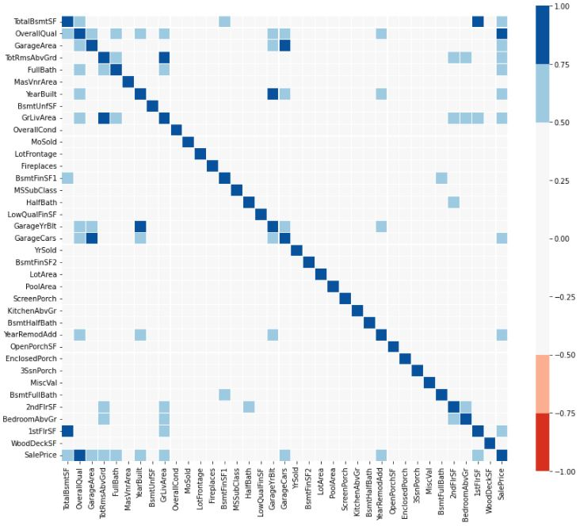
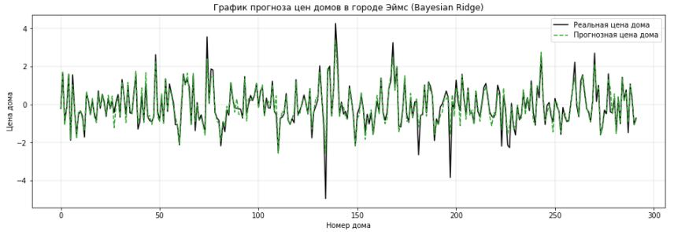

# Задача 6. Байес на практике и другие оксюмороны
Используя фреймворк байесовских методов и библиотеку PyMC3 необходимо построить интерпретируемую вероятностную модель и решить задачу регрессии для заданного датасета.
</br>Датасет доступен по ссылке: https://www.kaggle.com/c/house-prices-advanced-regression-techniques

## Подключение библиотек
```python
# Импорт основных библиотек
import numpy as np
import pandas as pd
import scipy.stats as stats

# Импорт библиотек машинного обучения
from sklearn.model_selection import train_test_split
from sklearn.pipeline import Pipeline
from sklearn.impute import SimpleImputer
from sklearn.metrics import mean_absolute_error 
from sklearn.preprocessing import MinMaxScaler, PowerTransformer
from sklearn.linear_model import LinearRegression, BayesianRidge
from sklearn.feature_selection import VarianceThreshold, SelectKBest, mutual_info_regression

# Импорт библиотеки байесовского анализа
import pymc3 as pm

# Импорт библиотеки численных вычислений
import theano

# Импорт библиотек построения диаграмм и графиков
import matplotlib.pyplot as plt
import seaborn as sns

# Импорт библиотеки управления предупреждениями
import warnings

# Определение режима вывода диаграмм
%matplotlib inline

# Отключение предупреждений
warnings.filterwarnings('ignore')

# Определение максимального количества колонок в таблице
pd.set_option('display.max_columns', None)
pd.set_option('display.max_rows', 100)

# Определение стиля вывода диаграмм
plt.rc('axes', grid=True)
plt.rc('grid', linewidth=0.3)
```

## Загрузка исходных данных
```python
# Загрузка исходного набора данных по продаже домов в городе Эймс
houses_data = pd.read_csv('train.csv', low_memory=False)
houses_data.head()
```


## Разведочный анализ
```python
# Сводная информация о структуре исходных данных
houses_data.info(show_counts=True)
```
```
<class 'pandas.core.frame.DataFrame'>
RangeIndex: 1460 entries, 0 to 1459
Data columns (total 81 columns):
 #   Column         Non-Null Count  Dtype  
---  ------         --------------  -----  
 0   Id             1460 non-null   int64  
 1   MSSubClass     1460 non-null   int64  
 2   MSZoning       1460 non-null   object 
 3   LotFrontage    1201 non-null   float64
 4   LotArea        1460 non-null   int64  
 5   Street         1460 non-null   object 
 6   Alley          91 non-null     object 
 7   LotShape       1460 non-null   object 
 8   LandContour    1460 non-null   object 
 9   Utilities      1460 non-null   object 
 10  LotConfig      1460 non-null   object 
 11  LandSlope      1460 non-null   object 
 12  Neighborhood   1460 non-null   object 
 13  Condition1     1460 non-null   object 
 14  Condition2     1460 non-null   object 
 15  BldgType       1460 non-null   object 
 16  HouseStyle     1460 non-null   object 
 17  OverallQual    1460 non-null   int64  
 18  OverallCond    1460 non-null   int64  
 19  YearBuilt      1460 non-null   int64  
 20  YearRemodAdd   1460 non-null   int64  
 21  RoofStyle      1460 non-null   object 
 22  RoofMatl       1460 non-null   object 
 23  Exterior1st    1460 non-null   object 
 24  Exterior2nd    1460 non-null   object 
 25  MasVnrType     1452 non-null   object 
 26  MasVnrArea     1452 non-null   float64
 27  ExterQual      1460 non-null   object 
 28  ExterCond      1460 non-null   object 
 29  Foundation     1460 non-null   object 
 30  BsmtQual       1423 non-null   object 
 31  BsmtCond       1423 non-null   object 
 32  BsmtExposure   1422 non-null   object 
 33  BsmtFinType1   1423 non-null   object 
 34  BsmtFinSF1     1460 non-null   int64  
 35  BsmtFinType2   1422 non-null   object 
 36  BsmtFinSF2     1460 non-null   int64  
 37  BsmtUnfSF      1460 non-null   int64  
 38  TotalBsmtSF    1460 non-null   int64  
 39  Heating        1460 non-null   object 
 40  HeatingQC      1460 non-null   object 
 41  CentralAir     1460 non-null   object 
 42  Electrical     1459 non-null   object 
 43  1stFlrSF       1460 non-null   int64  
 44  2ndFlrSF       1460 non-null   int64  
 45  LowQualFinSF   1460 non-null   int64  
 46  GrLivArea      1460 non-null   int64  
 47  BsmtFullBath   1460 non-null   int64  
 48  BsmtHalfBath   1460 non-null   int64  
 49  FullBath       1460 non-null   int64  
 50  HalfBath       1460 non-null   int64  
 51  BedroomAbvGr   1460 non-null   int64  
 52  KitchenAbvGr   1460 non-null   int64  
 53  KitchenQual    1460 non-null   object 
 54  TotRmsAbvGrd   1460 non-null   int64  
 55  Functional     1460 non-null   object 
 56  Fireplaces     1460 non-null   int64  
 57  FireplaceQu    770 non-null    object 
 58  GarageType     1379 non-null   object 
 59  GarageYrBlt    1379 non-null   float64
 60  GarageFinish   1379 non-null   object 
 61  GarageCars     1460 non-null   int64  
 62  GarageArea     1460 non-null   int64  
 63  GarageQual     1379 non-null   object 
 64  GarageCond     1379 non-null   object 
 65  PavedDrive     1460 non-null   object 
 66  WoodDeckSF     1460 non-null   int64  
 67  OpenPorchSF    1460 non-null   int64  
 68  EnclosedPorch  1460 non-null   int64  
 69  3SsnPorch      1460 non-null   int64  
 70  ScreenPorch    1460 non-null   int64  
 71  PoolArea       1460 non-null   int64  
 72  PoolQC         7 non-null      object 
 73  Fence          281 non-null    object 
 74  MiscFeature    54 non-null     object 
 75  MiscVal        1460 non-null   int64  
 76  MoSold         1460 non-null   int64  
 77  YrSold         1460 non-null   int64  
 78  SaleType       1460 non-null   object 
 79  SaleCondition  1460 non-null   object 
 80  SalePrice      1460 non-null   int64  
dtypes: float64(3), int64(35), object(43)
memory usage: 924.0+ KB
```

```python
# Определение количества признаков каждого типа
houses_data.dtypes.value_counts()
```
```
object     43
int64      35
float64     3
dtype: int64
```

```python
# Вывод процента отсутствующей информации в признаках
missing_data = houses_data.isna().sum() / len(houses_data) * 100
missing_data[missing_data > 0]
```
```
LotFrontage     17.739726
Alley           93.767123
MasVnrType       0.547945
MasVnrArea       0.547945
BsmtQual         2.534247
BsmtCond         2.534247
BsmtExposure     2.602740
BsmtFinType1     2.534247
BsmtFinType2     2.602740
Electrical       0.068493
FireplaceQu     47.260274
GarageType       5.547945
GarageYrBlt      5.547945
GarageFinish     5.547945
GarageQual       5.547945
GarageCond       5.547945
PoolQC          99.520548
Fence           80.753425
MiscFeature     96.301370
dtype: float64
```

```python
# Удаление из исходных данных идентификатора и признаков с большим количеством пропусков
houses_data.drop(columns=['Id', 'Alley', 'FireplaceQu', 'PoolQC', 'Fence', 'MiscFeature'], inplace=True)
```

```python
# Определение списка категориальных и количественных признаков, целевой признак SalePrice переносим в конец списка
categorical_features = houses_data.columns[houses_data.dtypes==object]
numerical_features = list(set(houses_data.columns) - set(categorical_features) - {'SalePrice'}) + ['SalePrice']
```

```python
# Построение гистограмм распределения данных в количественных признаках
fig, axes = plt.subplots(8, 5, figsize=(24, 30))

for ax, column in zip(axes.flat, numerical_features):
    sns.histplot(houses_data.sample(n=1000, random_state=42)[column], linewidth=0.1, palette='tab10', ax=ax)

plt.subplots_adjust(hspace=0.25, wspace=0.25)
    
# Вывод диаграммы
plt.show()
```


```python
# Функция применяет к данным степенное преобразование Бокса-Кокса
def boxcox(data: pd.Series):
    pipeline = Pipeline([
        ('scaler', MinMaxScaler(feature_range=(0.0001, 1))), 
        ('transformer', PowerTransformer(method='box-cox'))
    ])
    
    boxcox_data = pipeline.fit_transform(data.values[:, None])

    if stats.normaltest(boxcox_data).pvalue > stats.normaltest(data).pvalue:
        return boxcox_data.squeeze()
    else:
        return data.values
```

```python
# Приведение данных количественных признаков к виду более похожего на Гауссово распределение
fig, axes = plt.subplots(8, 5, figsize=(24, 30))

for ax, column in zip(axes.flat, numerical_features):
    sns.histplot(np.random.choice(boxcox(houses_data[column]), size=1000), linewidth=0.1, ax=ax)
    ax.set_xlabel(column)

plt.subplots_adjust(hspace=0.25, wspace=0.25)
    
# Вывод диаграммы
plt.show()
```


```python
# Вывод матрицы линейных корреляций количественных признаков
plt.figure(figsize=(14, 12))

color_map = sns.color_palette(['#d7301f', '#fcae91', '#f7f7f7', '#f7f7f7', '#f7f7f7', '#f7f7f7', '#9ecae1', '#08519c'])

sns.heatmap(
    houses_data[numerical_features].corr(), cmap=color_map, square=True, 
    vmin=-1, vmax=1, center= 0, linewidths=0.1, linecolor='white', cbar=True,
    cbar_kws=dict(ticks=np.arange(-1.0, 1.1, 0.25), aspect=35, pad=0.05)
)

# Вывод диаграммы
plt.show()
```


```python
# Вывод линейной корреляции между признаками и целевой переменной
fig, axes = plt.subplots(figsize=(16, 5))

correlated_features = houses_data[numerical_features].corrwith(houses_data['SalePrice'])[1:]

axes.bar(range(correlated_features.shape[0]), height=correlated_features.values, width=0.5)
axes.set(xlabel='Номер признака', ylabel='Значение коэффициента',
         title='Коэффициенты корреляции между целевой переменной и признаками')
axes.set_xticks(range(correlated_features.shape[0]))

# Вывод диаграммы
plt.show()
```


## Предобработка данных
```python
# Преобразование данных количественных признаков к виду более похожего на Гауссово распределение
numerical_df = pd.DataFrame(
    np.array([boxcox(houses_data[column]) for column in numerical_features]).T, 
    columns=numerical_features
)

# Преобразование категориальных признаков в двоичные признаки
categorical_df = pd.get_dummies(houses_data[categorical_features], drop_first=True)

# Объединение данных количественных и категориальных признаков
data_df = categorical_df.join(numerical_df)
# data_df = numerical_df.copy()
# data_df = houses_data[numerical_features].copy()

# Вывод структуры данных
data_df.info()
```
```
<class 'pandas.core.frame.DataFrame'>
RangeIndex: 1460 entries, 0 to 1459
Columns: 233 entries, MSZoning_FV to SalePrice
dtypes: float64(37), uint8(196)
memory usage: 701.6 KB
```

```python
# Разбиение данных на тренировочную и проверочную выборки
X_train, X_test, Y_train, Y_test = train_test_split(
    data_df.iloc[:, :-1], data_df.iloc[:, -1], train_size=0.8, random_state=42)

# Вывод размеров выборок
print("Размер Train выборки:", X_train.shape)
print("Размер Test выборки:", X_test.shape)
```
```
Размер Train выборки: (1168, 232)
Размер Test выборки: (292, 232)
```

## Построение модели
```python
# Построение модели классификации Linear Regression
processing_pipeline = Pipeline([
    ('imputer', SimpleImputer(strategy='most_frequent')),
    ('var_select', VarianceThreshold(0.01)),
    ('regressor', LinearRegression())
])

lrg_model = processing_pipeline.fit(X_train, Y_train)

# Вывод оценки качества модели
score = mean_absolute_error(Y_test, lrg_model.predict(X_test))
print('LinearRegression MAE: {:0.3f}'.format(score))
```
```
LinearRegression MAE: 0.222
```

```python
# Вывод графика сравнения прогнозной и реальной стоимостей домов в городе Эймс
fig, axes = plt.subplots(figsize=(16, 5))

axes.plot(Y_test.reset_index()['SalePrice'], color='black', label='Реальная цена дома')
axes.plot(lrg_model.predict(X_test), linestyle='--', color='tab:blue', label='Прогнозная цена дома')

axes.set(xlabel='Номер дома', ylabel='Цена дома', title='График прогноза цен домов в городе Эймс (Linear Regression)')
axes.legend(bbox_to_anchor=(1,1))

# Вывод диаграммы
plt.show()
```


```python
# Построение модели классификации Bayesian Ridge
processing_pipeline = Pipeline([
    ('imputer', SimpleImputer(strategy='most_frequent')),
    ('var_select', VarianceThreshold(0.01)),
    ('regressor', BayesianRidge())
])

bayes_model = processing_pipeline.fit(X_train, Y_train)

# Вывод оценки качества модели
score = mean_absolute_error(Y_test, bayes_model.predict(X_test))
print('BayesianRidge MAE: {:0.3f}'.format(score))
```
```
BayesianRidge MAE: 0.225
```

```python
# Вывод графика сравнения прогнозной и реальной стоимостей домов в городе Эймс
fig, axes = plt.subplots(figsize=(16, 5))

axes.plot(Y_test.reset_index()['SalePrice'], color='black', label='Реальная цена дома')
axes.plot(bayes_model.predict(X_test), linestyle='--', color='tab:green', label='Прогнозная цена дома')

axes.set(xlabel='Номер дома', ylabel='Цена дома', title='График прогноза цен домов в городе Эймс (Bayesian Ridge)')
axes.legend(bbox_to_anchor=(1,1))

# Вывод диаграммы
plt.show()
```


```python
# Построение модели классификации Bayes GLM
processing_pipeline = Pipeline([
    ('imputer', SimpleImputer(strategy='most_frequent')),
    ('var_select', VarianceThreshold(0.01)),
    ('feature_select', SelectKBest(mutual_info_regression, k=7))
])

X_shared = theano.shared(processing_pipeline.fit_transform(X_train, Y_train))

with pm.Model() as glm_model:
    pm.GLM(X_shared, Y_train, labels=list(map(str, range(X_shared.get_value().shape[1]))))
    trace = pm.sample(1000, tune=1000, chains=4, step=pm.Metropolis())

# Генерация данных из модели, используя параметры из апостериорных распределений
X_shared.set_value(processing_pipeline.fit_transform(X_test, Y_test))
sample_preds = pm.sample_posterior_predictive(trace, model=glm_model, samples=500)

# Вывод оценки качества модели
score = mean_absolute_error(Y_test, sample_preds['y'].mean(axis=0))
print('GLM MAE : {:0.3f}'.format(score))
```


```python
# Вывод графика сравнения прогнозной и реальной стоимостей домов в городе Эймс
fig, axes = plt.subplots(figsize=(16, 5))

axes.plot(Y_test.reset_index()['SalePrice'], color='black', label='Реальная цена дома')
axes.plot(sample_preds['y'].mean(axis=0), linestyle='--', color='tab:orange', label='Прогнозная цена дома')

axes.set(xlabel='Номер дома', ylabel='Цена дома', title='График прогноза цен домов в городе Эймс (Bayes GLM)')
axes.legend(bbox_to_anchor=(1,1))

# Вывод диаграммы
plt.show()
```

